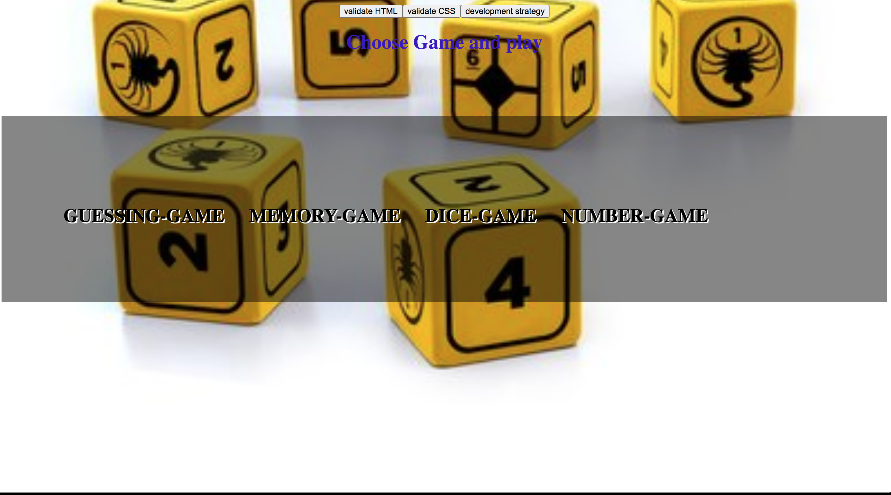
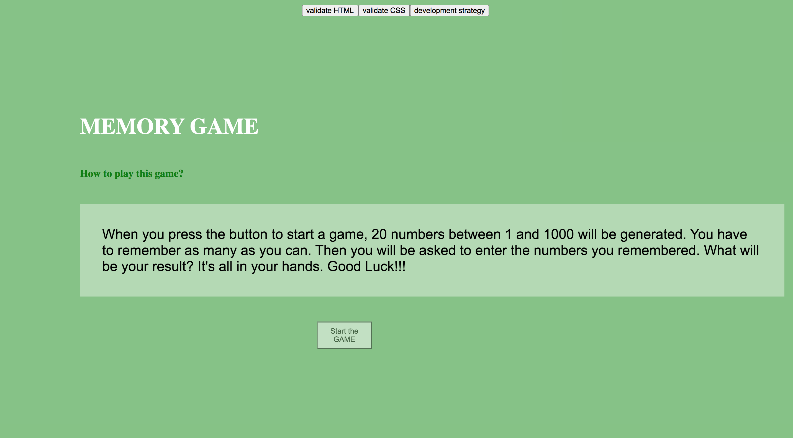
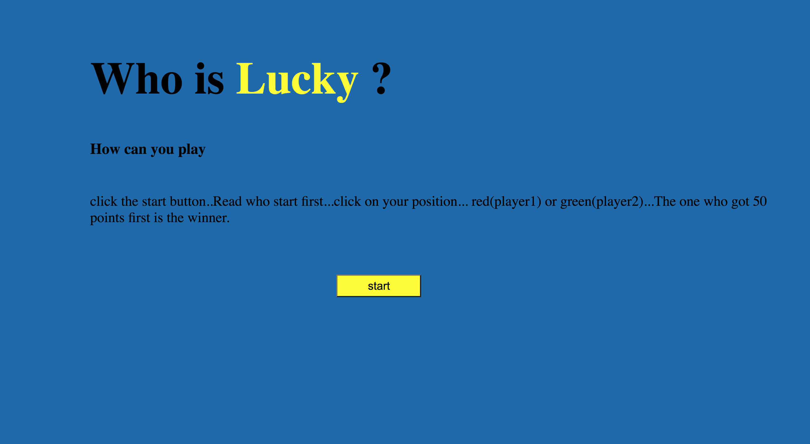
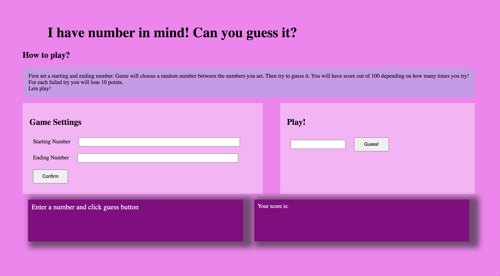

[![Contributors][contributors-shield]][contributors-url]
[![PR][pr-shield]][pr-url]
[![Issues][issues-shield]][issues-url]
[![Forks][forks-shield]][forks-url]
[![MIT License][license-shield]][license-url]

[contributors-shield]: https://img.shields.io/badge/4-Contributors%20-brightgreen
[contributors-url]: https://github.com/yildiraykoyuncu/testing-module-project-simple-games/graphs/contributors
[forks-shield]: https://img.shields.io/badge/-Forks-blue
[forks-url]: https://github.com/yildiraykoyuncu/testing-module-project-simple-games/network/members
[issues-shield]: https://img.shields.io/badge/-ISSUES-green
[issues-url]: https://github.com/yildiraykoyuncu/testing-module-project-simple-games/issues
[pr-shield]: https://img.shields.io/badge/-Pull%20Requests%20-blueviolet
[pr-url]: https://github.com/yildiraykoyuncu/testing-module-project-simple-games/pulls
[license-shield]: https://img.shields.io/badge/-LICENSE-red
[license-url]: https://github.com/yildiraykoyuncu/testing-module-project-simple-games/blob/master/LICENSE

# Simple Games

This project is the last one from the module-3 (Testing) from HYF-Belgium. 

The goal of this project is to develop team group skills as well as JS skills (arrays, objects, UI and so on). To improve this skills four games were programming, the games are:

* Guessing;
* Memory; 
* Dice; 
* Number

## How to play it

To play the games, is just needed to click on the button on `index.html`

---

### Guessing game

On this game, the user is asked to guess the hight of the top 10 highest mountains in the world.

---
### Memory game

To play this game, the user is asked to push a button, then 20 numbers between 1 and 1000 are presented. The user needs to memorize it and rewrite the numbers on the right order.

---
### Dice game

For the dice game, to users push a button that represents a dice. The user that arrives to 50 first is the winner.

---
### Number game

The number game works as the following explanation.First, the user set a starting and ending number. The game chooses a random number between the numbers that the user sets. Then the user try to guess it. The user has a score out of 100 depending on how many tries its needed to guess the number! For each failed try the user looses 10 points.
